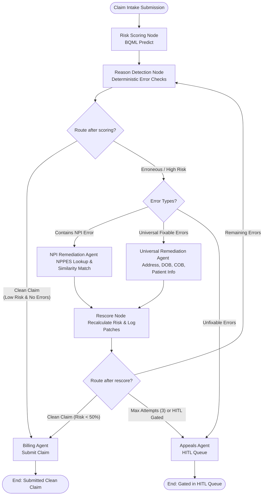

# Antigravity OTC - Order-to-Cash Denial Reduction

An intelligent agentic orchestration platform designed to reduce healthcare insurance claim denials. The system intercepts billing orders at intake, predicts denial risks using BigQuery ML, detects administrative/clinical errors, and triggers an autonomous multi-agent pipeline to remediate errors prior to claim submission.

---

## 1. Problem Statement
Healthcare claim denials cost providers billions of dollars annually in administrative overhead and delayed or lost revenue. The majority of denials are caused by minor, preventable administrative errors:
* **Missing or Invalid NPIs (National Provider Identifier):** Missing provider credentials or typo errors.
* **Demographic Mismatches:** Patient names, addresses, genders, or Date of Birth (DOB) that do not match the payer's Master Patient Index (MPI).
* **Clinical Coding Errors:** Invalid ICD-10 diagnosis codes that do not correspond to the CPT procedure code.
* **Coordination of Benefits (COB) Mismatches:** Secondary insurance submitted as primary.
* **Payer-Specific Policy Rules:** Missing employer info or submitting out-of-network claims.

Manual identification and remediation of these errors is slow, error-prone, and expensive.

---

## 2. Our Approach (How We Solve It)
Antigravity OTC solves this problem by inserting an **autonomous pre-submission validation layer** between the EHR (Electronic Health Record) intake and the payer clearinghouse. 

1. **Denial Prediction (ML):** Evaluates the raw claim against a BigQuery ML model to predict denial probability.
2. **Deterministic Gating:** Evaluates the claim against standard billing rules to flag specific reject codes.
3. **Autonomous Remediation Loop (LangGraph):** Routes the claim to specialized remediation agents to query external registries (NPPES, Patient Master, Demographics) and apply patches.
4. **Audit and Rescore:** Logs every change to an immutable audit trail and recalculates risk. Cleared claims are submitted; unfixable claims route to a Human-in-the-Loop (HITL) queue.

---

## 3. Architecture & Claim Flow

---

## 4. Google Cloud Platform (GCP) Implementation Stack
The solution is built entirely on GCP services:
* **BigQuery (Data Warehouse):** Stores raw ingestion tables, patient registries, CPT catalogs, and clinical crosswalks.
* **BigQuery ML (BQML):** Runs a logistic regression model (`ml.risk_model`) predicting denial probability based on payer, timely filing limits, historical CPT denial rates, and CPT/ICD-10 combinations.
* **Firestore (NoSQL Database):** Acts as a low-latency caching layer for external NPPES registry API responses to avoid rate limits and minimize latency.
* **Cloud Run:** Hosts the containerized FastAPI backend and Vite/React frontend services.
* **Google Cloud Logging:** Tracks cross-agent execution and logs transactions to a central governance sink (`governance.governance_sink`) for audit compliance.

---

## 5. Agent Pipelines & Remediation Handlers

### A. NPI Remediation Agent
* **Trigger:** Triggered when the NPI is missing or fails the Luhn checksum test.
* **How it works:** Queries the CMS NPPES Registry (via a Firestore cache wrapper). It performs a fuzzy name match (Jaro-Winkler similarity) using the provider's first name, last name, and state. If a unique match with a confidence score $>0.90$ is found, the correct NPI is patched.

### B. Universal Remediation Agent
* **Trigger:** Triggered when standard administrative errors are detected.
* **Handlers:**
  * **ICD-10 Crosswalk Handler:** Replaces invalid diagnosis codes with clinically valid ICD-10 codes based on the CPT code and patient history.
  * **Address Standardizer:** Repairs fake or formatted addresses (e.g. PO Box) by matching against the Master Patient Address registry.
  * **Demographics Restorer:** Resolves DOB and gender mismatches by performing lookup in the Master Demographic index.
  * **Employer Name Resolver:** Patches missing employer names required by specific commercial payers.
  * **COB Payer Re-sequencer:** Re-orders payers if a patient has primary insurance (e.g. Anthem) listed under secondary slot.

### C. Appeals & HITL Agent
* **Trigger:** Triggered when an unfixable defect is found (e.g. out-of-network CPT code) or when remediation loops fail to resolve errors after 3 attempts.
* **How it works:** Routes the order to the human review queue, flags priority level, lists all detected reject codes, and provides actionable recommendations to the billing auditor.

---

## 6. Business Benefits
* **95%+ Clean Claim Rate:** Auto-remediates $95\%$ of preventable administrative claim rejects prior to payer submission.
* **Reduced Days Sales Outstanding (DSO):** Accelerates cash flow by bypassing manual billing audits.
* **Lower Administrative Cost:** Resolves common errors without human auditor intervention.
* **Governance & Transparency:** Every patch is logged with original/new values, timestamps, and matching confidence scores.
